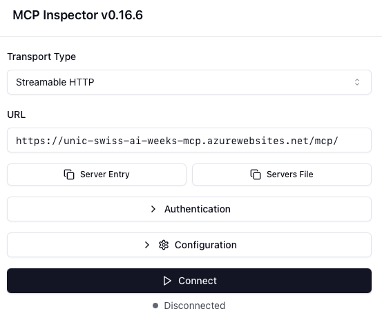
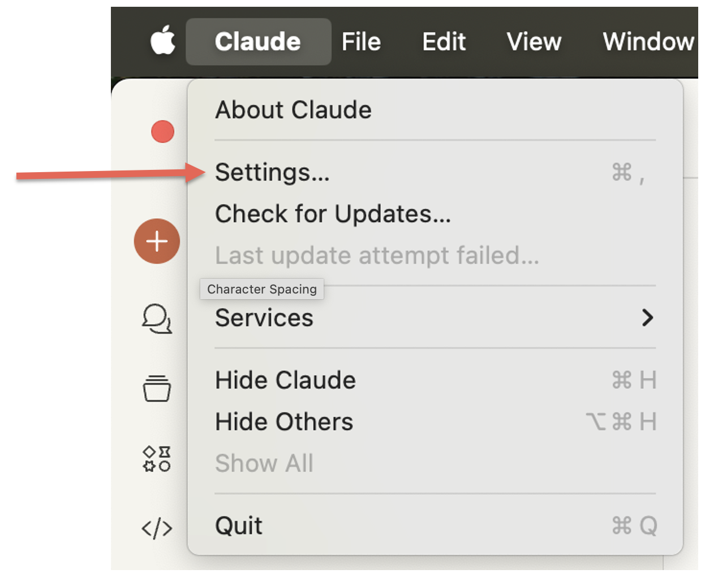
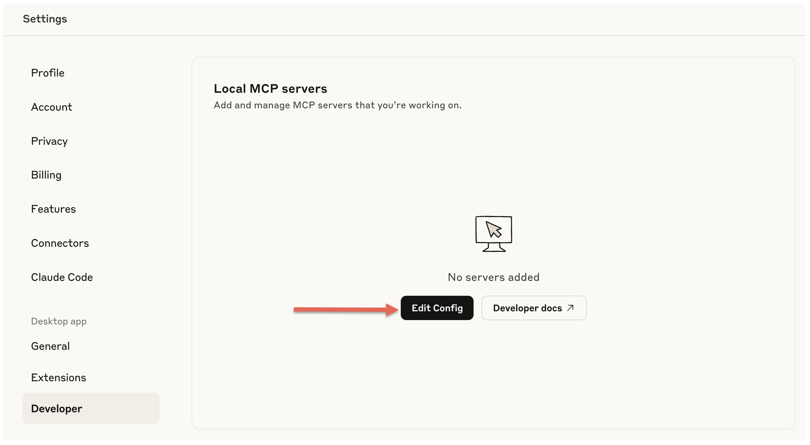

# MCP Server Einrichtung - Anleitung

Diese Anleitung führt dich durch die Einrichtung von MCP (Model Context Protocol) Servern auf Mac und Windows.

## Inhaltsverzeichnis

1. [MCP Inspector](#1-mcp-inspector)
2. [MCP Server Setup mit Claude Desktop](#2-mcp-server-setup-mit-claude-desktop)
3. [Setup mit VSCode](#3-setup-mit-vscode)
4. [Alternative: Lokaler MCP Server mit Ollama](#4-alternative-lokaler-mcp-server-mit-ollama)
5. [Troubleshooting](#troubleshooting)

## 1. MCP Inspector

MCP Inspector ist ein Entwicklertool von Anthropic zum Testen und Debuggen von MCP-Servern. Es besteht aus einer React-basierten Web-UI (Inspector Client) und einem MCP Proxy, der den Browser mit MCP-Servern verbindet. Das Tool hilft Entwicklern, ihre MCP-Server-Implementierungen während der Integration oder Entwicklung zu validieren und Fehler zu beheben.

### NodeJS Installation

Bevor du MCP Inspector nutzen kannst, musst du Node.js installieren:

#### Mac
1. Besuche https://nodejs.org/download
2. Lade die LTS-Version für macOS herunter, auf "macOS Installer (.pkg)" klicken
3. Öffne die heruntergeladene .pkg-Datei
4. Folge den Installationsanweisungen
5. Terminal öffnen (in der macOS Suche den Begriff Terminal eingeben)
6. Überprüfe die Installation im Terminal:
   ```bash
   node --version
   npm --version
   ```
7. Bei erfolgreicher Installation wird das Terminal die Versionen ausgeben:
   ```bash
   v22.18.0
   10.9.3
   ```

Alternativ mit Homebrew:
1. Terminal öffnen
2. Folgenden Command ausführen:
   ```bash
   brew install node
   ```

#### Windows
1. Besuche https://nodejs.org/download
2. Lade die LTS-Version für Windows herunter
3. Führe die .msi-Datei aus
4. Folge dem Installationsassistenten
5. In Startmenü nach Powershell suchen
6. Überprüfe die Installation in der Eingabeaufforderung/Powershell:
   ```cmd
   node --version
   npm --version
   ```

### MCP Inspector starten

Nach der Node.js Installation kannst du MCP Inspector einfach ausführen:

#### Mac & Windows

1. Terminal oder PowerShell öffnen
2. Folgenden Command ausführen:
   ```bash
   npx @modelcontextprotocol/inspector
   ```
3. Installation der Packages bestätigen

4. <span style="color: red;">Inspector wird in Browser Tab geöffnet, Streamable HTTP selektieren und MCP URL eingeben</span>
    <p align="left">
        
    </p>
5. Connect drücken

Weitere Informationen findest du im offiziellen Repository: https://github.com/modelcontextprotocol/inspector

## 2. MCP Server Setup mit Claude Desktop (Empfohlen)

### Schritt 1: Claude Desktop installieren

Besuche https://claude.ai/download und lade Claude Desktop für dein Betriebssystem herunter:

#### Mac
- Lade die .dmg-Datei herunter
- Öffne die .dmg-Datei
- Ziehe Claude in den Programme-Ordner

#### Windows
- Lade die .exe-Datei herunter
- Führe die Installation aus
- Folge den Installationsanweisungen

### Schritt 2: Einloggen/Registrieren

Starte Claude Desktop und logge dich mit deinem Anthropic-Konto ein oder registriere dich.

### Schritt 3: Settings öffnen

Öffne die Einstellungen in Claude Desktop.

<p align="left">
    
</p>

### Schritt 4: "Edit Config" in Developer Settings

Klicke in den Developer Settings auf "Edit Config".

<p align="left">
    
</p>

### Schritt 5: JSON-Konfiguration bearbeiten

Bearbeite die JSON-Konfiguration so, dass sie folgendermassen aussieht:

<div style="border: 2px solid red; padding: 10px;">

```json
{
  "mcpServers": {
    "swiss-ai-weeks-mcp": {
      "command": "npx",
      "args": [
          "mcp-remote",
          "http://localhost:8000/mcp/"
      ]
    }
  }
}
```
</div>

Oder füge diesen Teil in eine bestehende Konfiguration ein:

<div style="border: 2px solid red; padding: 10px;">

```json
"swiss-ai-weeks-mcp": {
    "command": "npx",
    "args": [
        "mcp-remote",
        "http://localhost:8000/mcp/"
    ]
}
```

</div>

### Schritt 6: Speichern und Claude neustarten

Speichere die Konfiguration und starte Claude Desktop neu, damit die Änderungen wirksam werden.

## 3. Setup mit VSCode

Für Entwickler, die bereits VSCode nutzen, gibt es auch eine VSCode-Integration:

### Installation und Konfiguration

1. Öffne die Command Palette mit `CMD + Shift + P`
2. Wähle "MCP: Add Server" aus
3. Wähle "HTTP" als Art von Server aus
4. Gib die URL ein (aus der JSON Konfiguration hier kopieren)
5. Gib einen Namen ein, z.B. `unic-swiss-ai-weeks-mcp`
6. Wähle aus, ob der Server überall oder nur im Workspace verfügbar sein soll
7. Mit Github Copilot Agent den MCP Server nutzen

Am Ende sollte der Server in der Konfiguration in `mcp.json` so aussehen:


<div style="border: 2px solid red; padding: 10px;">

```json
"unic-swiss-ai-weeks-mcp": {
    "url": "http://localhost:8000/mcp/",
    "type": "http"
}
```

</div>

## 4. Alternative: Lokaler MCP Server mit Ollama

Als Alternative kannst du auch einen MCP-Server mit einem lokalen LLM verbinden. Das ermöglicht dir mehr Kontrolle und erhöht den Schutz deiner Daten.

### Was ist Ollama?

Ollama ist ein Tool, das es ermöglicht, große Sprachmodelle (LLMs) lokal auf deinem Computer auszuführen. In Kombination mit MCPHost kannst du MCP-Server mit lokalen LLMs verwenden.

### Automatische Installation

Wir haben Installationsskripte erstellt, die den gesamten Prozess automatisieren:

#### Mac

Lade das Skript herunter und führe es aus:

```bash
curl -O https://raw.githubusercontent.com/unic/MCP-Setup-Instructions/main/mcp_install_mac.sh
chmod +x mcp_install_mac.sh
./mcp_install_mac.sh
```

**Was macht das Skript:**
- Installiert Homebrew (falls nicht vorhanden)
- Installiert Ollama und Go
- Startet den Ollama-Service
- Lädt das Qwen3:8b Modell herunter (unterstützt Tool-Calling)
- Installiert MCPHost über Go
- Erstellt die MCP-Konfigurationsdatei
- Konfiguriert die PATH-Variable

#### Windows

**Voraussetzung:** Installiere zuerst Ollama manuell von https://ollama.com/download/windows

Lade dann das PowerShell-Skript herunter und führe es als Administrator aus:

```powershell
# PowerShell als Administrator öffnen
Invoke-WebRequest -Uri "https://raw.githubusercontent.com/unic/MCP-Setup-Instructions/main/mcp_install_windows.ps1" -OutFile "mcp_install_windows.ps1"
.\mcp_install_windows.ps1
```

> **Hinweis:** Falls beim Ausführen des Skripts eine Fehlermeldung bezüglich Berechtigungen erscheint, setze die Ausführungsrichtlinie mit folgendem Befehl (nur einmal notwendig):
>
> ```powershell
> Set-ExecutionPolicy -ExecutionPolicy RemoteSigned -Scope CurrentUser
> ```

**Was macht das Skript:**
- Prüft ob Go und Ollama installiert sind
- Installiert Go automatisch (über winget, falls verfügbar)
- Lädt das Qwen3:8b Modell herunter (unterstützt Tool-Calling)
- Installiert MCPHost über Go
- Erstellt die MCP-Konfigurationsdatei
- Konfiguriert die PATH-Variable

### Manuelle Installation

#### Schritt 1: Ollama installieren

**Mac:**
```bash
brew install ollama
brew services start ollama
```

**Windows:**
Lade Ollama von https://ollama.com/download/windows herunter und installiere es.

#### Schritt 2: LLM-Modell mit Tool-Calling herunterladen

```bash
ollama run qwen2.5
# oder
ollama run qwen3:8b
```

#### Schritt 3: Go installieren

**Mac:**
```bash
brew install go
```

**Windows:**
Verwende winget oder lade Go von https://go.dev/doc/install herunter.

#### Schritt 4: MCPHost installieren

```bash
go install github.com/mark3labs/mcphost@latest
```

#### Schritt 5: Konfigurationsdatei erstellen

Erstelle eine `mcp_config.json` Datei:

```json
{
  "mcpServers": {
    "swiss-ai-weeks-mcp": {
      "command": "npx",
      "args": [
        "mcp-remote",
        "http://localhost:8000/mcp/"
      ]
    }
  }
}
```

#### Schritt 6: MCPHost starten

```bash
mcphost -m ollama:qwen2.5 --config "pfad/zur/mcp_config.json"
```

### Vorteile der lokalen Installation

- **Privatsphäre**: Alle Daten bleiben auf deinem Computer
- **Offline-Nutzung**: Funktioniert ohne Internetverbindung
- **Anpassbar**: Verschiedene Modelle und Konfigurationen möglich
- **Kostenfrei**: Keine API-Kosten für die Nutzung

---