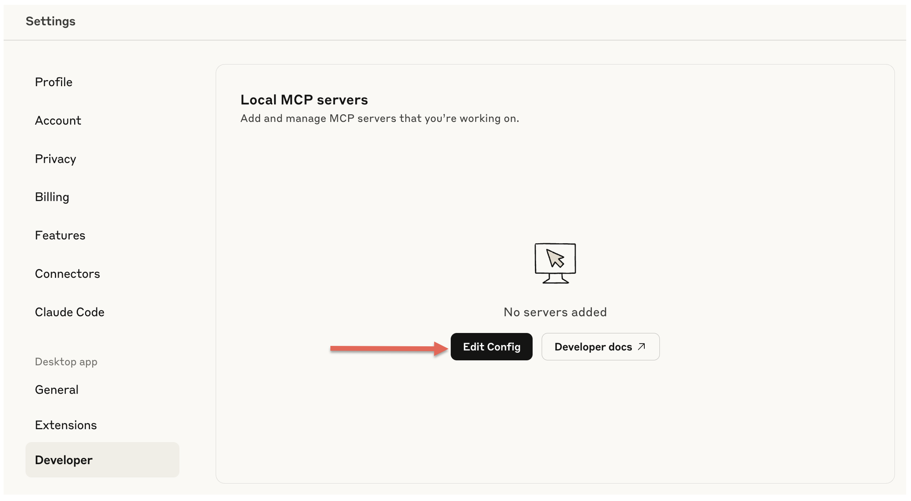

# MCP Server Einrichtung - Anleitung

Diese Anleitung führt Sie durch die Einrichtung von MCP (Model Context Protocol) Servern auf Mac und Windows.

## 1. MCP Inspector

MCP Inspector ist ein Entwicklertool von Anthropic zum Testen und Debuggen von MCP-Servern. Es besteht aus einer React-basierten Web-UI (Inspector Client) und einem MCP Proxy, der den Browser mit MCP-Servern verbindet. Das Tool hilft Entwicklern, ihre MCP-Server-Implementierungen während der Integration oder Entwicklung zu validieren und Fehler zu beheben.

### NodeJS Installation

Bevor Sie MCP Inspector nutzen können, müssen Sie Node.js installieren:

#### Mac
1. Besuchen Sie https://nodejs.org/
2. Laden Sie die LTS-Version für macOS herunter
3. Öffnen Sie die heruntergeladene .pkg-Datei
4. Folgen Sie den Installationsanweisungen
5. Überprüfen Sie die Installation im Terminal:
   ```bash
   node --version
   npm --version
   ```

Alternativ mit Homebrew:
```bash
brew install node
```

#### Windows
1. Besuchen Sie https://nodejs.org/
2. Laden Sie die LTS-Version für Windows herunter
3. Führen Sie die .msi-Datei aus
4. Folgen Sie dem Installationsassistenten
5. Überprüfen Sie die Installation in der Eingabeaufforderung:
   ```cmd
   node --version
   npm --version
   ```

### MCP Inspector starten

Nach der Node.js Installation können Sie MCP Inspector einfach ausführen:

#### Mac & Windows
```bash
npx @modelcontextprotocol/inspector
```

Weitere Informationen finden Sie im offiziellen Repository: https://github.com/modelcontextprotocol/inspector

## 2. MCP Server Setup mit Claude Desktop

### Schritt 1: Claude Desktop installieren

Besuchen Sie https://claude.ai/download und laden Sie Claude Desktop für Ihr Betriebssystem herunter:

#### Mac
- Laden Sie die .dmg-Datei herunter
- Öffnen Sie die .dmg-Datei
- Ziehen Sie Claude in den Programme-Ordner

#### Windows
- Laden Sie die .exe-Datei herunter
- Führen Sie die Installation aus
- Folgen Sie den Installationsanweisungen

### Schritt 2: Einloggen/Registrieren

Starten Sie Claude Desktop und loggen Sie sich mit Ihrem Anthropic-Konto ein oder registrieren Sie sich.

### Schritt 3: Settings öffnen

Öffnen Sie die Einstellungen in Claude Desktop.

<p align="left">
    
</p>

### Schritt 4: "Edit Config" in Developer Settings

Klicken Sie in den Developer Settings auf "Edit Config".

<p align="left">
    
</p>

### Schritt 5: JSON-Konfiguration bearbeiten

Bearbeiten Sie die JSON-Konfiguration so, dass sie folgendermassen aussieht:

```json
{
  "mcpServers": {
    "swiss-ai-weeks-mcp": {
      "command": "npx",
      "args": [
          "mcp-remote",
          "https://unic-swiss-ai-weeks-mcp.azurewebsites.net/mcp/"
      ]
    }
  }
}
```

Oder fügen Sie diesen Teil in eine bestehende Konfiguration ein:

```json
"swiss-ai-weeks-mcp": {
    "command": "npx",
    "args": [
        "mcp-remote",
        "http://localhost:8000/mcp/"
    ]
}
```

### Schritt 6: Speichern und Claude neustarten

Speichern Sie die Konfiguration und starten Sie Claude Desktop neu, damit die Änderungen wirksam werden.

## 3. Setup mit VSCode

Für Entwickler, die bereits VSCode nutzen, gibt es auch eine VSCode-Integration:

### Installation und Konfiguration

1. Öffnen Sie die Command Palette mit `CMD + Shift + P`
2. Wählen Sie "MCP: Add Server" aus
3. Wählen Sie "HTTP" als Art von Server aus
4. Geben Sie die URL ein (aus dem GitHub Gist kopieren)
5. Geben Sie einen Namen ein, z.B. `unic-swiss-ai-weeks-mcp`
6. Wählen Sie aus, ob der Server überall oder nur im Workspace verfügbar sein soll

Am Ende sollte der Server in der Konfiguration so aussehen:

```json
"unic-swiss-ai-weeks-mcp": {
    "url": "http://localhost:8000/mcp/",
    "type": "http"
}
```

---

## 4. Alternative: Lokaler MCP Server mit Ollama

Als Alternative zu den Remote-Servern können Sie auch einen lokalen MCP Server mit Ollama einrichten. Dies bietet mehr Kontrolle und Privatsphäre, da alle Daten lokal verarbeitet werden.

### Was ist Ollama?

Ollama ist ein Tool, das es ermöglicht, große Sprachmodelle (LLMs) lokal auf Ihrem Computer auszuführen. In Kombination mit MCPHost können Sie MCP-Server mit lokalen LLMs verwenden.

### Automatische Installation

Wir haben Installationsskripte erstellt, die den gesamten Prozess automatisieren:

#### Mac

Laden Sie das Skript herunter und führen Sie es aus:

```bash
curl -O https://raw.githubusercontent.com/your-repo/MCP-Setup-Instructions/main/mcp_install_mac.sh
chmod +x mcp_install_mac.sh
./mcp_install_mac.sh
```

**Was macht das Skript:**
- Installiert Homebrew (falls nicht vorhanden)
- Installiert Ollama, Go und Node.js
- Startet den Ollama-Service
- Lädt das Qwen3:8b Modell herunter (unterstützt Tool-Calling)
- Installiert MCPHost über Go
- Erstellt die MCP-Konfigurationsdatei
- Konfiguriert die PATH-Variable

#### Windows

Laden Sie das PowerShell-Skript herunter und führen Sie es als Administrator aus:

```powershell
# PowerShell als Administrator öffnen
Invoke-WebRequest -Uri "https://raw.githubusercontent.com/your-repo/MCP-Setup-Instructions/main/mcp_install_windows.ps1" -OutFile "mcp_install_windows.ps1"
Set-ExecutionPolicy -ExecutionPolicy RemoteSigned -Scope CurrentUser
.\mcp_install_windows.ps1
```

### Manuelle Installation

#### Schritt 1: Ollama installieren

**Mac:**
```bash
brew install ollama
brew services start ollama
```

**Windows:**
Laden Sie Ollama von https://ollama.com/download/windows herunter und installieren Sie es.

#### Schritt 2: LLM-Modell mit Tool-Calling herunterladen

```bash
ollama run qwen2.5
# oder
ollama run qwen3:8b
```

#### Schritt 3: Go installieren

**Mac:**
```bash
brew install go
```

**Windows:**
Verwenden Sie winget oder laden Sie Go von https://go.dev/doc/install herunter.

#### Schritt 4: MCPHost installieren

```bash
go install github.com/mark3labs/mcphost@latest
```

#### Schritt 5: Konfigurationsdatei erstellen

Erstellen Sie eine `mcp_config.json` Datei:

```json
{
  "mcpServers": {
    "swiss-ai-weeks-mcp": {
      "command": "npx",
      "args": [
        "mcp-remote",
        "http://localhost:8000/mcp/"
      ]
    }
  }
}
```

#### Schritt 6: MCPHost starten

```bash
mcphost -m ollama:qwen2.5 --config "pfad/zur/mcp_config.json"
```

### Vorteile der lokalen Installation

- **Privatsphäre**: Alle Daten bleiben auf Ihrem Computer
- **Offline-Nutzung**: Funktioniert ohne Internetverbindung
- **Anpassbar**: Verschiedene Modelle und Konfigurationen möglich
- **Kostenfrei**: Keine API-Kosten für die Nutzung

---